# Poker8 Online Network MVP Implementation Roadmap

> **For agentic workers:** REQUIRED SUB-SKILL: Use superpowers:subagent-driven-development (recommended) or superpowers:executing-plans to implement this plan task-by-task. Steps use checkbox (`- [ ]`) syntax for tracking.

**Goal:** Deliver the approved multiplayer play-money Poker8 MVP without mixing future USDT functionality into the implementation.

**Architecture:** Preserve the existing Python poker engine and mobile table renderer, but replace the global in-memory application and mutable SQLite balances with a tenant-aware FastAPI application, PostgreSQL-backed ledger, serialized per-table runtimes, and authenticated WebSocket clients. Work is split into three independently verifiable plans so each stage leaves runnable software.

**Tech Stack:** Python 3.12, FastAPI, Pydantic 2, SQLAlchemy 2 async, Alembic, PostgreSQL 16, psycopg 3, vanilla HTML/CSS/JavaScript, pytest, Starlette TestClient, Playwright, Docker Compose.

---

## Why this is split

The approved MVP contains three dependent but independently testable systems:

1. tenant identity, persistence, wallet ledger, and table catalogue;
2. authoritative table runtime, seating, WebSocket protocol, timers, and recovery;
3. lobby/table/profile clients, chat/history, tenant packaging, and release hardening.

Trying to change all three inside the current 630-line `app/main.py`, 1,000-line SQLite store, and 2,100-line browser client in one pass would make regressions difficult to isolate. Execute the plans in the listed order.

## Plan sequence

1. [Foundation, Identity, Ledger, and Lobby Data](./2026-08-14-online-mvp-foundation.md)
2. [Authoritative Table Runtime and Realtime Protocol](./2026-08-14-online-mvp-runtime.md)
3. [Online Client, Social Surface, and Release Hardening](./2026-08-14-online-mvp-client-release.md)

## Locked file structure

### Existing modules retained

- `poker/engine.py` — authoritative NLHE rules and pot settlement.
- `poker/models.py` — in-hand domain state.
- `poker/evaluator.py` — hand evaluation.
- `bots/` — built-in play-money system-player decisions.
- `static/app.js` — existing high-quality table renderer, adapted behind a transport boundary rather than rewritten.
- `static/style.css`, `static/mobile.css`, and `static/v0*.js` — current visual table layers.

### New online domain

- `online/config.py` — environment and tenant secret references.
- `online/database.py` — async SQLAlchemy engine and transaction boundary.
- `online/schema.py` — SQLAlchemy Core metadata shared with Alembic.
- `online/auth.py` — Telegram initData verification and opaque sessions.
- `online/ledger.py` — integer-unit play ledger and table escrow.
- `online/catalogue.py` — six-table seed, lobby queries, and Quick Play selection.
- `online/seating.py` — FIFO queue, ready, seat, hold, observe, leave, and add-on rules.
- `online/serialization.py` — lossless private game-state snapshots.
- `online/runtime.py` — per-table lock, revisions, command idempotency, and engine orchestration.
- `online/scheduler.py` — action, disconnect, result, reset, and next-hand deadlines.
- `online/events.py` — table event fan-out and Network Integrity event recording.
- `online/history.py` — participant-scoped last-20-hand views and progression.
- `online/chat.py` — last-50 table messages and rate limiting.

### FastAPI boundary

- `app/online.py` — application factory and lifespan.
- `app/dependencies.py` — authenticated session, database session, and tenant dependencies.
- `app/routers/auth.py` — Telegram and development login.
- `app/routers/lobby.py` — public table catalogue and Quick Play.
- `app/routers/tables.py` — table snapshot, ready, queue, leave, observe, and add-on endpoints.
- `app/routers/profiles.py` — profile, wallet journal, and hand history.
- `app/routers/chat.py` — message history and posting.
- `app/routers/realtime.py` — authenticated table WebSocket.
- `app/routers/health.py` — liveness and readiness.
- `app/main.py` — final thin production export of `app.online:app`.

### Browser client

- `static/lobby.html`, `static/lobby.js` — six-card lobby and Quick Play.
- `static/profile.html`, `static/profile.js` — level, wins, balances, ledger, and last 20 hands.
- `static/online-transport.js` — cookie auth and WebSocket reconnect/resync.
- `static/network.css` — lobby/profile/co-branding styles.
- `static/index.html`, `static/app.js` — retained table screen connected through `online-transport.js`.

### Operations and verification

- `alembic.ini`, `migrations/` — PostgreSQL schema evolution.
- `compose.yaml` — local PostgreSQL.
- `.env.example` — non-secret configuration names.
- `tests/online/` — domain, API, WebSocket, recovery, and PostgreSQL integration tests.
- `tests/e2e/` — mobile browser acceptance tests.
- `tests/load/online_mvp_load.py` — 100-connection/20-table load probe.
- `docs/runbooks/online-mvp.md` — startup, migration, backup, recovery, and second-bot procedure.

## Dependency graph

```mermaid
flowchart LR
    A["Foundation: config and PostgreSQL"] --> B["Identity and sessions"]
    B --> C["Play ledger and table catalogue"]
    C --> D["Seating and escrow"]
    D --> E["Table runtime and snapshots"]
    E --> F["WebSocket and timers"]
    F --> G["Lobby and table clients"]
    G --> H["Profile, history, and chat"]
    H --> I["Recovery, load, and release gate"]
```



## Baseline evidence

Baseline command run before plan creation:

```powershell
.\.venv\Scripts\python.exe -m pytest -q
```

Observed result on 2026-08-14:

```text
1 failed, 56 passed
```

The only failure is `tests/test_table_store.py::test_six_bot_seats_can_be_activated`, which attempts to activate six bots while the default human remains seated, contradicting the current 6-max policy. Foundation Task 1 corrects the obsolete fixture before any online behavior is added.

## Release gates

The Online MVP may be called complete only when all of these commands pass:

```powershell
.\.venv\Scripts\python.exe -m pytest -q
.\.venv\Scripts\python.exe -m pytest -m postgres -q
.\.venv\Scripts\python.exe -m pytest tests/e2e -m e2e -q
.\.venv\Scripts\python.exe tests/load/online_mvp_load.py --base-url http://127.0.0.1:8000 --connections 100 --tables 20 --duration 120
git diff --check
```

Expected final result:

- no failed or skipped required tests;
- no duplicated command, seat, or ledger effect;
- exact hand recovery after process restart;
- six public network tables visible through the default tenant;
- mobile Lobby → Quick Play → Table → Result → Next Hand flow passes;
- the repository contains no `CASH_USDT`, deposit, withdrawal, blockchain, or KYC runtime endpoint.

## Commit policy

Each task in the child plans ends with a focused commit. Do not combine database, game-runtime, and frontend migrations into one commit. Never stage the existing user-owned SQLite database or `.superpowers/` browser artifacts.
