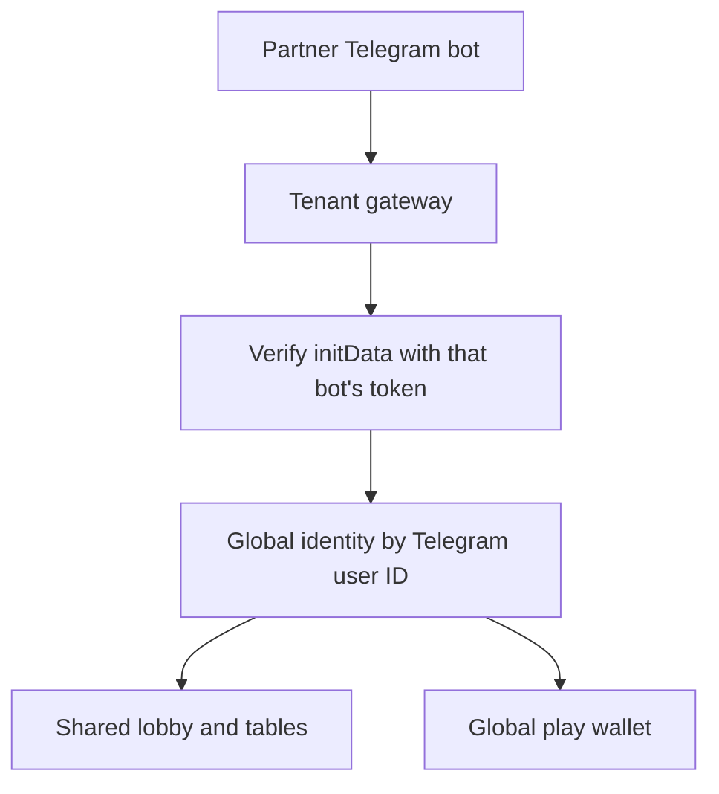

# Poker8 Online Network MVP Design

**Date:** 2026-08-14

**Status:** Approved in design discussion

**Scope:** Multiplayer play-money MVP with a tenant-ready foundation for future partner Telegram bots

## 1. Objective

Turn the existing single-process Poker8 prototype into a usable online 6-max NLHE cash-table product. The MVP must support human players, built-in system bots, spectators, a lobby, reconnects, chat, profiles, hand history, and a reliable play-money ledger.

The product will initially run through one Telegram bot and one deployment. Its data model and authentication boundary must nevertheless support future partner bots without duplicating users, balances, or game state.

Real-money play, USDT deposits, withdrawals, KYC, and payment-provider integrations are explicitly outside this MVP.

## 2. Product boundaries

### Included

- One production Telegram bot represented by a default tenant.
- Local predefined Telegram profiles for development only.
- One global user account per Telegram ID.
- One global play-money wallet per user across the future network.
- Six public network tables displayed on one lobby page.
- 6-max NLHE cash games with humans and built-in system bots.
- Spectator entry, seat selection, Quick Play, and a FIFO seat queue.
- WebSocket-driven real-time table state.
- Reconnect, timeout, crash recovery, and exact unfinished-hand restoration.
- Table chat, profile, level avatar, wallet journal, and last 20 hands.
- Tenant and permanent acquisition-attribution fields required to attach more bots later.

### Excluded

- USDT or any other real-money deposits, withdrawals, or conversion.
- KYC and real-money responsible-gambling controls.
- Any conversion between play chips and a monetary asset.
- Partner dashboards and partner settlement.
- User-created or tenant-exclusive tables.
- Tournaments, Omaha, and other poker formats.
- User-supplied poker bots or a public bot API.
- Multiple partner deployments in the first release.
- Redis, Kubernetes, and speculative microservices.

## 3. Tenant and account model

Each future partner bot is a tenant-facing entry point, not an independent copy of the poker network.



Rules:

- The server derives `tenant_id` from the receiving bot/gateway. A client-supplied tenant identifier is never trusted.
- Telegram `initData` is verified with the token belonging to that tenant's bot.
- The verified Telegram user ID maps to one global `user_id`.
- The first successfully verified tenant is permanently stored as `acquisition_partner_id`.
- Opening another partner bot records `access_tenant_id` for analytics but does not change acquisition attribution.
- The user's profile, level, wallet, active seat, and hand history follow the user across all bots.
- Telegram IDs are never exposed to other players.
- Partner bot tokens and future payment secrets are stored in a secret manager or environment-backed secret reference, never as plaintext application data.

For future commercial attribution, gaming revenue remains assigned to the first acquisition partner. Fees belonging to a concrete payment operation will be attributed to the payment channel actually used. Neither mechanism is active in the play-money MVP.

## 4. Deployment architecture

The MVP remains a modular FastAPI monolith so the existing Python poker engine and bots can be reused.

```text
FastAPI application
├── Tenant and Telegram authentication
├── Users and profiles
├── Lobby and table directory
├── Table sessions
├── Poker engine and system bots
├── Play-wallet ledger
├── Chat
├── Hand history
└── WebSocket gateway
             ↓
         PostgreSQL
```

The server is authoritative for cards, the deck, legal actions, turn order, timers, bets, pots, and settlement. Clients render state and submit commands; they never calculate an authoritative outcome.

Commands for one table are processed serially through a per-table execution boundary so two simultaneous actions cannot advance the same state revision. A new deck is produced with an operating-system cryptographic random source, and its exact shuffled order is persisted for recovery without being exposed to clients during the hand.

The initial target is one application instance, approximately 100 concurrent connections, and approximately 20 active tables. PostgreSQL replaces SQLite for concurrent production writes. Redis and a separate message broker are not required at this load.

When partner bots are added, each may have its own Mini App URL, domain, visual configuration, and lightweight gateway. All gateways connect to the same central identity, wallet, lobby, and game authority. They must not maintain independent wallet or table databases.

## 5. Partner packaging

A tenant may configure:

- Telegram bot credentials reference;
- Mini App URL and support links;
- name, logo, theme, and approved assets;
- acquisition and campaign metadata;
- allowed regions and feature flags;
- a future payment-adapter reference.

All tenants use one frontend codebase and one versioned game protocol. Branding is configuration, not a source-code fork. A tenant can be disabled without stopping the network. A client with an incompatible protocol version must refresh before joining a table.

The table schema supports `network` and future `tenant` visibility. Every table in this MVP is `network`. Tenant-exclusive tables are deferred.

## 6. Lobby and table catalogue

The lobby displays six tables per page and starts with exactly six public network tables:

- two tables with blinds `0.5 / 1`;
- two tables with blinds `1 / 2`;
- two tables with blinds `5 / 10`;
- buy-in range `40–100 BB` for every table.

Each card explicitly labels both values, for example `Blinds 0.5/1` and `Entry 40–100`.

Bots count toward the visible occupancy figure because they occupy seats, but the interface must not claim they are human. At the table they remain marked `AI`.

Quick Play selects the most occupied table with a free seat at the lowest stake the user can afford. It then opens the buy-in flow. If no seat is free, Quick Play enters the user as a spectator and appends a confirmed seat request to the relevant FIFO queue.

If a seated player returns to the lobby, the seat remains active, timers continue, and the lobby shows `Return to table`. A user may have only one active seated table globally, while spectating other tables remains allowed.

## 7. Seating and readiness

1. A user enters any room as a spectator.
2. The user selects a seat or uses Quick Play, chooses a buy-in, and explicitly confirms `Ready`.
3. A user who does not confirm remains a spectator and no chips are reserved.
4. A confirmed request joins a server-side FIFO queue. Disconnected or expired spectator requests are removed so they cannot create ghost seats.
5. At a boundary between hands, the server rechecks the wallet, active-seat constraint, and table capacity.
6. The server reserves the buy-in, removes a system bot if needed, and seats the first eligible queued user atomically.
7. Humans replace bots only between hands, never during an active hand.
8. After the first confirmed seating, the player automatically participates in subsequent hands.
9. `Observe` or `Leave table` takes effect between hands and returns the remaining table stack to the play wallet.

System bots seed empty seats and keep tables playable. Bot difficulty is mixed by stake:

- `0.5 / 1`: Easy and Normal;
- `1 / 2`: Normal and Hard;
- `5 / 10`: Hard and Maximum.

Exact difficulty is not shown to players.

A bot receives only the public table state and its own hole cards. It cannot read the remaining deck or another player's hidden cards through the engine API.

## 8. Hand and disconnect lifecycle

The ordinary action timer is 30 seconds. If it expires, the server performs CHECK when legal and otherwise FOLD.

After a hand settles, the entire transition lasts seven seconds:

- seconds 0–4: keep the result, winning combination, cards, and chips visible;
- at second 4: smoothly clear cards and chips;
- seconds 4–7: show a clean table, `New hand`, and a `3…2…1` countdown;
- at second 7: deal the next hand.

Players may choose `Observe` throughout this seven-second window.

On connection loss:

- the current action timer continues;
- timeout still produces CHECK if legal, otherwise FOLD;
- the seat remains reserved through the current hand and for another 60 seconds;
- already committed chips remain in the pot and settle normally;
- a reconnecting Telegram identity returns to the same seat;
- if the hold expires, the remaining stack returns to the wallet and the seat passes to the queue or a bot.

## 9. Play-wallet and table escrow

Play chips use an append-only, balanced ledger. A cached balance may exist for fast reads, but the ledger is the source of truth.

```text
System play faucet → available play wallet
Available play wallet → seat escrow
Seat escrows → hand pot → winner seat escrow
Seat escrow → available play wallet on exit
```

Rules:

- The profile distinguishes available wallet balance from the stack reserved at the active table.
- Seating transfers the buy-in from the wallet to seat escrow in one database transaction.
- In-hand bets move value inside table escrow and are not debited a second time from the wallet.
- Hand settlement creates one balanced transaction group among the participating escrow accounts.
- Leaving transfers the remaining escrow balance back to the wallet.
- Re-buy/add-on is allowed only between hands and may increase a stack only up to 100 BB.
- A free top-up credits the play wallet, never the seated stack directly.
- The current free top-up behavior remains available without rate or lifetime limits; table buy-in limits still apply.
- Every transaction group has an immutable transaction ID and idempotency key.
- Debits and credits within a transaction group must balance.
- Balances and escrow accounts may never become negative.

`faucet_grant` is a production command only for the `PLAY` asset. The client cannot submit an arbitrary ledger entry type; it may only request an allowed play top-up, after which the server constructs the grant. A database constraint rejects `faucet_grant` for every other asset.

Future `CASH_USDT` accounts will live in a separate financial service and schema that does not implement a faucet command. No `PLAY → CASH_USDT` transfer or conversion operation will exist.

## 10. Profile, avatars, and statistics

The public name comes from Telegram. The public avatar is selected by the number of hands won with a positive net settlement:

- level 0: 0–9 wins;
- level 1: 10–49 wins;
- level 2: 50–99 wins;
- level 3: 100–199 wins;
- level 4: 200–499 wins;
- level 5: 500+ wins.

A fold-win counts. A tie or break-even result does not.

The MVP profile contains Telegram display name, level avatar, wins, hands played, available play balance, active table stack, and the play-wallet journal.

Built-in bots may use a global public-observation model for each account. The model includes sample size, recency decay, VPIP, PFR, 3-bet frequency, fold-to-3-bet, postflop aggression, confidence, and derived public traits. It must never use hidden or mucked cards, private Telegram identifiers, or information unavailable to a human observer. Stronger bot levels may use more of this model; small samples must have low confidence.

## 11. Table chat and hand history

Table chat is text-only and keeps the latest 50 messages. It uses the verified public display identity, applies a server-side rate limit, and supports local mute. Direct messages, images, files, and global chat are excluded.

The profile exposes the last 20 hands with:

- hand ID;
- participants and positions;
- public actions and pot;
- final result;
- the user's own hole cards;
- opponent cards only when shown at showdown.

Replay, charts, and export are deferred.

## 12. Real-time protocol and idempotency

Each table maintains a strictly increasing state revision.

- On connection, the client receives a complete snapshot.
- Subsequent WebSocket messages carry ordered events and revisions.
- A player command includes a globally unique `command_id`, expected revision, action type, and action payload.
- The server validates actor, turn, legality, amount, and table revision.
- Repeating a completed `command_id` returns its stored result without applying it again.
- A stale or gapped client receives a fresh full snapshot.
- Client display state is replaceable; authoritative state remains on the server.

HTTP remains available for authentication, profile, history, and other request/response operations. WebSocket is the real-time table channel.

## 13. Persistence and crash recovery

After every accepted game command, the server persists both the command record and a full recoverable hand snapshot. The snapshot includes:

- exact deck order and dealt cards;
- board and hole cards;
- stacks, committed amounts, pots, and side pots;
- legal-action context and current actor;
- dealer and positional state;
- timers and deadlines;
- folded, all-in, disconnected, and pending states;
- current table revision.

After a process restart, the server restores the same hand rather than voiding it. Restored action timers receive at least 10 seconds so clients can reconnect.

If PostgreSQL or the ledger becomes unavailable, new hands do not start. An affected active table pauses rather than estimating or reconstructing financial state. Any mismatch among pot, stacks, escrow, and ledger blocks the table and emits an administrative incident record.

Seat assignment, buy-in reservation, stack return, and ledger effects must either commit together or roll back together.

## 14. Core data entities and constraints

Expected entities:

- `tenants`;
- `tenant_bots`;
- `users`;
- `user_attributions`;
- `user_tenant_visits`;
- `play_wallet_accounts`;
- `play_ledger_transactions` and `play_ledger_entries`;
- `poker_tables`;
- `table_seats`;
- `seat_queue`;
- `hands`;
- `hand_players`;
- `hand_actions`;
- `chat_messages`.

Database constraints must enforce:

- one global user per Telegram ID;
- immutable first acquisition attribution under ordinary application access;
- at most one active seated table per user;
- at most six occupied seats per table;
- unique idempotency keys within their operation scope;
- non-negative wallet and escrow balances;
- balanced ledger transaction groups;
- faucet grants only for the play asset.

## 15. Future real-money boundary

The future target currency is USDT over TRC20, handled by a custodial payment partner. Poker8 must not store blockchain private keys. A payment partner would create deposit instructions, monitor confirmations, and call a signed idempotent webhook; the central cashier would credit a separate cash ledger.

This is a future architecture note, not MVP functionality. Direct TRON wallet integration inside the Telegram Mini App is not approved by this design. Telegram platform rules, target jurisdiction, operator licensing, KYC/AML, sanctions screening, withdrawal routing, and payment-provider terms must be resolved before enabling cash play.

The future intended structure is:

- one legal operator and one central cash wallet across partner brands;
- partner bots act as branded distribution/payment channels;
- cash balance follows the verified global account;
- withdrawals are selected by the central cashier based on eligible verified methods, not merely the currently open bot;
- payment-source information and partner attribution remain auditable;
- real-money public tables may join the shared network only after the legal and financial controls are complete.

## 16. Verification strategy

### Poker engine

- Legal actions and bet sizing.
- All-in, side pots, ties, and showdown.
- CHECK/FOLD timeout behavior.
- Bot action legality across configured difficulty mixes.

### Table state machine

- Spectator to queue to seat.
- Bot replacement only between hands.
- One active seat per user.
- Re-buy, leave, return, and stack refund.
- Seven-second result/reset/deal sequence.
- Disconnect, timeout, reconnect, and seat expiry.

### Ledger invariants

- Balanced transaction groups.
- No negative wallet or escrow account.
- No duplicated effect from a repeated command.
- Conservation of chips during a hand and explicit faucet source outside it.
- Faucet support only for `PLAY`.
- No route from play assets to a future cash asset.

### Tenant and network security

- `initData` verified with the correct bot token.
- Client tenant spoofing rejected.
- One Telegram ID resolves to one user through different bots.
- First acquisition attribution cannot be overwritten by a later visit.
- Secrets never appear in public responses or logs.

### Recovery and integration

- WebSocket resynchronization after a missed revision.
- Exact hand restoration after process restart.
- Idempotent retries across HTTP and WebSocket commands.
- Transaction rollback on failed seat or ledger operation.
- PostgreSQL backup and restore exercise.

### Acceptance and load

- Mobile path: Lobby → Quick Play → Table → Hand → Result → Next Hand.
- Chat, profile, wallet journal, and hand history.
- Approximately 100 concurrent connections and 20 active tables.
- Logs and metrics correlated by tenant, table, hand, and command ID without exposing Telegram IDs to players.

## 17. MVP completion criterion

The MVP is complete when the approved product flow works for concurrent human players and system bots on the six public network tables, state and play balances survive reconnects and process restarts, tenant identity boundaries are enforced, and the verification suite passes at the target load.

Completion means the system is ready to attach a second test bot to the play-money network. It does not mean the system is licensed, compliant, or ready to accept USDT.
