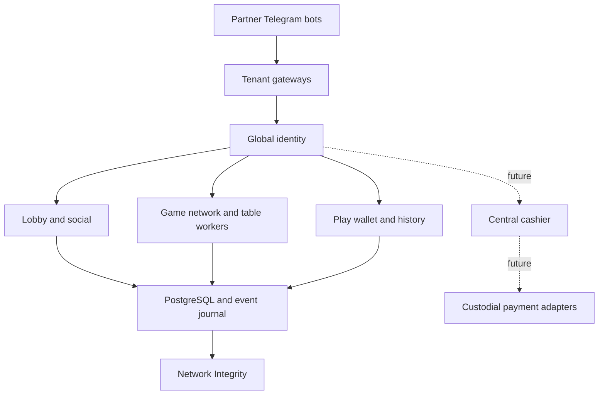

# Poker8 Product Vision

**Date:** 2026-08-14

**Status:** Approved direction

**Horizon:** Long-term product direction beyond the online MVP

**Related MVP specification:** [Online Network MVP Design](./2026-08-14-online-network-mvp-design.md)

## 1. Purpose of this document

This document is Poker8's long-term product north star. It records the destination, architectural direction, and order of capability growth without pretending that every future feature is ready to implement.

The approved online MVP remains a separately bounded project. Every major post-MVP capability must receive its own design and implementation plan before work begins.

## 2. Product thesis

Poker8 is a shared poker network reached through multiple branded Telegram bots, not a collection of independent game copies.

Each partner receives its own bot, Mini App entry point, branding, audience relationship, and future payment integration. Players keep one network account, profile, progression, social identity, game history, and balance across every entry point.

The player-facing model is co-branded: the partner brand remains visible and the product identifies the shared platform as `Powered by Poker8`. This makes the common account, balance, tables, and opponents understandable rather than surprising.

Poker8 is Telegram-first. The server protocol and domain model remain independent of Telegram UI so another client can be added later without rewriting tables, wallets, or accounts. Other platforms are not part of the current roadmap.

## 3. Non-negotiable principles

- One verified Telegram user maps to one global Poker8 account.
- The first acquisition partner is assigned permanently after the first successfully verified entry.
- Later visits through other bots do not replace acquisition attribution.
- The shared player pool belongs to the Poker8 network, not to one partner bot.
- Poker rules, cards, timers, actions, and settlement are controlled by one authoritative server core.
- Partner versions differ through configuration and branding, never through game-result logic.
- Play-money balances are global across the network.
- Play-money assets can never be sold, withdrawn, or converted into a monetary asset.
- Progression, cosmetics, and paid presentation features never affect cards, odds, legal actions, or bot strength.
- Every balance change has an immutable, auditable ledger cause.
- A partner integration must not create an independent user, wallet, or table database.
- Shared functionality is extended through versioned interfaces, not source-code forks.

## 4. Player identity and partner attribution

Every tenant gateway verifies Telegram `initData` with its own bot token. After verification, the Telegram user ID resolves to the global Poker8 user.

The identity model distinguishes:

- `user_id`: the global internal Poker8 identity;
- `telegram_user_id`: the verified Telegram identity;
- `acquisition_partner_id`: the immutable first partner;
- `access_tenant_id`: the bot used for the current session;
- tenant-scoped campaign and visit metadata.

The same user may enter through another partner bot, see the same profile and balance, and return to the same active table. A user may play at only one table at a time while observing others.

The first partner retains commercial attribution in the future. Concrete payment-operation fees remain attributable to the actual payment channel. Revenue formulas and monetization are intentionally outside this document.

## 5. Shared network experience

Public Poker8 tables are network resources and can appear in every partner lobby. A partner may eventually host tenant-exclusive rooms, but shared public liquidity remains the primary product.

Network invitations are independent of a particular bot. A player may invite someone from another partner bot to the same table. The recipient opens the table through a preferred or already associated bot while keeping the original acquisition attribution.

The network experience includes:

- a common lobby and Quick Play;
- shared public tables;
- spectators and server-side seat queues;
- cross-bot table invitations;
- global profiles and progression;
- shared hand history and active-table recovery;
- tenant-aware chat and support boundaries;
- consistent rules and client protocol versions.

## 6. System players and fair play

Built-in system players support liquidity only in the play-money network. Humans replace them between hands, never during an active hand.

System players use ordinary names, avatars, frames, and progression. The large `AI` seat label is not shown. Their detailed profile contains the neutral disclosure `System player` so they are not represented as a human account.

System-player levels are earned through actual wins using the same public thresholds as human profiles. Difficulty is independent of cosmetic level and is not displayed at the seat.

Bots may adapt to global, publicly observable player tendencies with recency decay, sample-size confidence, and strict information boundaries. They may receive only public table state and their own hole cards. They never receive the remaining deck, another player's hidden cards, private Telegram data, or integrity data.

System players never participate in future real-money games, never own a cash wallet, and never create operator income by winning customer funds.

## 7. Progression and social direction

Progression is cosmetic and social:

- level-based avatars and frames;
- achievements;
- seasons and rankings;
- profile presentation;
- cosmetic rewards and play chips;
- social invitations and friend relationships.

No progression reward changes game mechanics or gives a decision-making advantage.

Future user-created play-money tables may configure:

- public or invitation-only access;
- room name;
- an allowed blind level;
- minimum and maximum buy-in;
- turn timer;
- number of system players;
- friend or invite-code access.

The room creator controls access and permitted settings, but never balances, cards, shuffle, settlement, or hidden information. Creator income and rake sharing are outside this vision and require a separate decision.

## 8. Capability roadmap

The roadmap is ordered by capabilities and transition criteria, not speculative dates.

### Stage 1 — Online MVP

Deliver the separately approved Online Network MVP:

- one production Telegram bot and one default tenant;
- six public play-money 6-max NLHE tables;
- humans and system players;
- lobby, spectators, FIFO seat queue, and Quick Play;
- WebSocket state, reconnects, chat, profile, and hand history;
- reliable play ledger and table escrow;
- exact active-hand recovery after a process restart;
- tenant-ready identity and data fields.

Transition criterion: concurrent gameplay, balances, reconnects, and restart recovery are reliable at the approved MVP load.

### Stage 2 — Network Beta

Attach a second test bot to prove the network model:

- one account and play wallet through both bots;
- one shared table catalogue;
- return to an active table through either entry point;
- immutable first-partner attribution;
- `Powered by Poker8` co-branding;
- cross-bot invitations;
- configuration-based themes without code forks.

Transition criterion: a user can move across bots safely while tenant data and secrets remain isolated.

### Stage 3 — Social network and user-created rooms

- friend relationships and invitations;
- private rooms by link or code;
- user-created play-money tables;
- approved blind, buy-in, timer, and system-player settings;
- seasons, rankings, achievements, and cosmetic progression;
- network-wide profile and system-player levels.

Transition criterion: user-created rooms cannot bypass wallet, fairness, moderation, or table-capacity rules.

### Stage 4 — Partner platform

- controlled onboarding of partner bots;
- tenant branding and feature configuration;
- gateway health and client-version management;
- acquisition, activity, and retention analytics;
- attribution audit;
- tenant-scoped support access;
- a versioned future payment-adapter contract.

Transition criterion: another partner can be connected through configuration and documented interfaces without copying application code or network data.

### Stage 5 — Product expansion and scale

- Sit & Go;
- scheduled tournaments and freerolls;
- table-worker scaling based on measured load;
- centralized Network Integrity;
- detection of collusion, chip dumping, multi-accounting, and automation;
- additional poker variants only after NLHE liquidity is sufficient.

Transition criterion: new formats do not damage the liquidity, reliability, or integrity of the primary 6-max NLHE pool.

### Stage 6 — Separate future USDT capability

Only after a dedicated design, legal assessment, and operational readiness:

- `CASH_USDT` remains fully separate from `PLAY`;
- one operator owns one central cash wallet across partner brands;
- a verified user's cash balance follows the global account and is not copied or transferred between bot-specific wallets;
- USDT-TRC20 is handled through a custodial payment partner;
- Poker8 does not store blockchain private keys;
- a central cashier owns deposits, withdrawals, and cash-ledger commands;
- every deposit records its tenant, payment partner, payment session, and source-method metadata;
- the central cashier chooses an eligible verified withdrawal method from account history rather than blindly using the currently open bot;
- a payment-partner outage cannot alter or erase the authoritative Poker8 cash ledger;
- identity, KYC/AML, sanctions, source-of-funds, withdrawal, and platform requirements are completed before cash play;
- direct TRON wallet integration inside the Mini App is not assumed and must pass a separate Telegram-platform compliance review;
- system players are excluded from cash tables;
- play assets have no cash conversion path.

This stage is architectural direction, not permission to accept money after merely connecting a webhook.

## 9. Partner platform and data access

A partner-facing platform may provide:

- attributable accounts;
- activity and retention metrics;
- game counts;
- future settlement information within that partner's scope;
- gateway health;
- campaign conversion.

Partners do not receive cards, private game state, chat exports, complete wallet history, another tenant's users, or Network Integrity investigation data.

The gateway for a tenant may access the Telegram IDs of users who interact with that bot. Other tenants cannot access those IDs.

A future payment partner may receive Telegram ID as a separate protected field when required to:

- send an invoice or status directly through its Telegram bot;
- reconcile a payment manually;
- support and locate a user;
- satisfy a required payment API field.

The payment transaction is never keyed by Telegram ID. The central cashier creates a random `deposit_session_id`, which remains the authoritative correlation and idempotency reference. Telegram ID is transmitted server-to-server, encrypted at rest, excluded from ordinary logs, access-audited, purpose-limited, retention-limited, and isolated from other tenants.

## 10. Network Integrity

Network Integrity is centralized because abuse can cross partner bots and tables. It consumes network events required to identify:

- collusion;
- chip dumping;
- coordinated play;
- multi-accounting;
- prohibited automation or external assistance;
- linked sessions, devices, and future payment addresses;
- anomalous behavior by system players.

Account restrictions apply across the network. A partner cannot independently remove a network-level restriction. The play-money MVP records the necessary authoritative events; automated enforcement and investigation tooling are a later capability.

## 11. Architectural direction

Poker8 begins as a modular FastAPI monolith and splits only under measured operational pressure.

Component ownership:

- Global Identity owns Telegram mapping and the network account.
- Tenant Gateway validates a bot and applies tenant presentation.
- Game Network owns tables, queues, authoritative game state, and recovery.
- Play Wallet owns play balances and ledger operations.
- Social owns friendships, invitations, and user-created room metadata.
- Network Integrity receives authoritative events and owns global restrictions.
- Partner Platform owns tenant configuration and permitted analytics.
- A future Central Cashier owns cash-only accounts and payment adapters.

Evolution rules:

- do not create independent partner databases for users, wallets, or tables;
- do not fork frontend or poker rules per tenant;
- split services only when capacity or isolation measurements justify it;
- use idempotent commands and versioned interfaces;
- persist recoverable game state and immutable audits;
- stop an affected table when an invariant fails instead of approximating state;
- isolate gateway failures so one partner cannot stop the shared pool.

## 12. Directional success indicators

Poker8 is moving toward the vision when:

- time to find a playable seat falls;
- more tables contain multiple human players;
- users return through different bots without losing state;
- a new bot is attached through configuration instead of a code fork;
- cross-bot invitations place players at one shared table;
- profile, balance, history, and level agree at every entry point;
- retries and failures do not duplicate chips, seats, or actions;
- system players sustain play-money liquidity and yield seats to humans;
- integrity analysis works across tenants;
- new game modes launch only when the primary pool can support them.

## 13. Prohibited shortcuts

- A mutable balance with no authoritative ledger.
- A cloned database for a new partner.
- Tenant-specific poker outcome logic.
- Hidden conversion from `PLAY` to a monetary asset.
- System players in future cash games.
- Sharing user data beyond an explicit operational purpose.
- Using Telegram ID as a payment transaction identifier.
- Starting USDT operations merely because a payment callback works.
- Launching many game modes before the main pool has sufficient liquidity.

## 14. Intentionally deferred decisions

The following subjects are not fixed by this Product Vision and require separate design work:

- monetization and rake;
- geography and jurisdiction structure;
- the custodial payment provider;
- exact KYC/AML procedures;
- delivery dates for roadmap stages;
- non-Telegram client delivery;
- tournament and user-created-table economics.

## 15. Vision completion statement

The product vision is achieved when multiple independently branded Telegram bots feed one trustworthy Poker8 network in which a player keeps one identity and experience, partners integrate without forks, shared liquidity grows safely, social and creator features deepen retention, and any later monetary capability is added as a separately controlled system rather than mixed into the play-money game.
